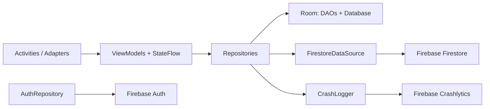

# D03 - Arquitectura móvil

```mermaid
flowchart LR
UI[Activities / Adapters] --> VM[ViewModels + StateFlow]
VM --> R[Repositories]
R --> L[Room: DAOs + Database]
R --> F[FirestoreDataSource]
R --> C[CrashLogger]
A[AuthRepository] --> FA[Firebase Auth]
F --> FS[Firebase Firestore]
C --> FC[Firebase Crashlytics]
```
