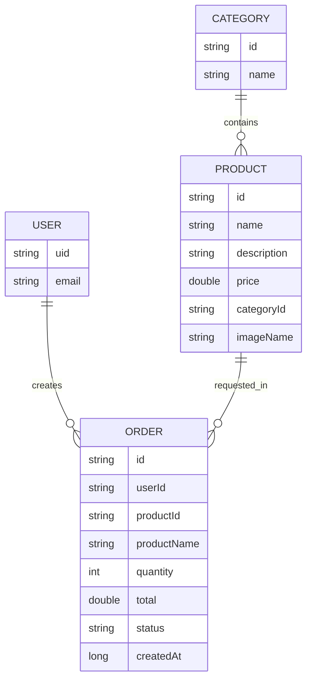

# D04 - Modelo de datos local y remoto

```mermaid
erDiagram
USER ||--o{ ORDER : creates
CATEGORY ||--o{ PRODUCT : contains
PRODUCT ||--o{ ORDER : requested_in

USER {
  string uid
  string email
}
PRODUCT {
  string id
  string name
  string description
  double price
  string categoryId
  string imageName
}
CATEGORY {
  string id
  string name
}
ORDER {
  string id
  string userId
  string productId
  string productName
  int quantity
  double total
  string status
  long createdAt
}
```
