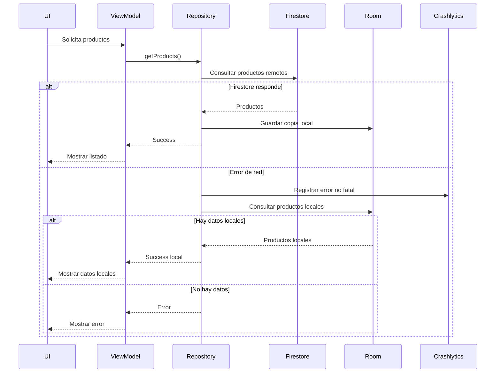

# D05 - Sincronización local-remoto

```mermaid
sequenceDiagram
participant UI as UI
participant VM as ViewModel
participant R as Repository
participant Fire as Firestore
participant Room as Room
participant Crash as Crashlytics

UI->>VM: Solicita productos
VM->>R: getProducts()
R->>Fire: Consultar productos remotos
alt Firestore responde
  Fire-->>R: Productos
  R->>Room: Guardar copia local
  R-->>VM: Success
  VM-->>UI: Mostrar listado
else Error de red
  R->>Crash: Registrar error no fatal
  R->>Room: Consultar productos locales
  alt Hay datos locales
    Room-->>R: Productos locales
    R-->>VM: Success local
    VM-->>UI: Mostrar datos locales
  else No hay datos
    R-->>VM: Error
    VM-->>UI: Mostrar error
  end
end
```
