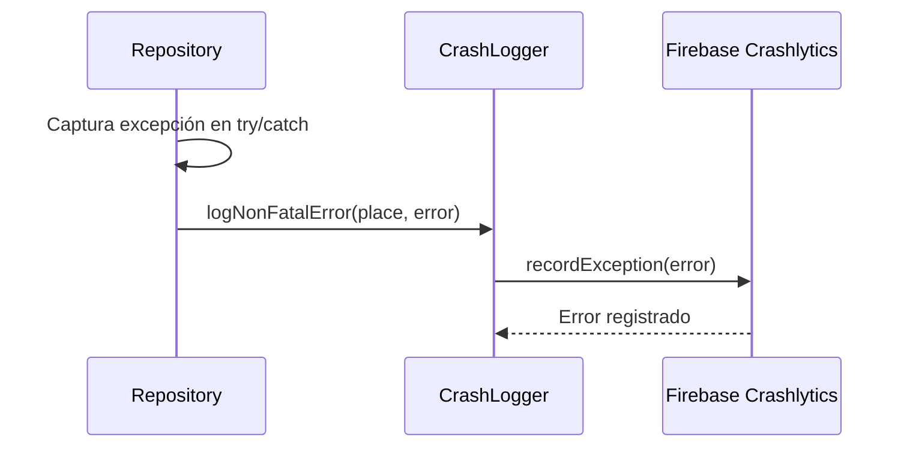

# D06.3 - Secuencia registro de error

```mermaid
sequenceDiagram
participant R as Repository
participant C as CrashLogger
participant F as Firebase Crashlytics

R->>R: Captura excepción en try/catch
R->>C: logNonFatalError(place, error)
C->>F: recordException(error)
F-->>C: Error registrado
```
