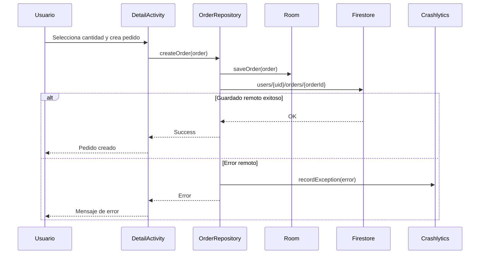

# D06.2 - Secuencia crear pedido

```mermaid
sequenceDiagram
participant U as Usuario
participant D as DetailActivity
participant R as OrderRepository
participant Room as Room
participant Fire as Firestore
participant Crash as Crashlytics

U->>D: Selecciona cantidad y crea pedido
D->>R: createOrder(order)
R->>Room: saveOrder(order)
R->>Fire: users/{uid}/orders/{orderId}
alt Guardado remoto exitoso
  Fire-->>R: OK
  R-->>D: Success
  D-->>U: Pedido creado
else Error remoto
  R->>Crash: recordException(error)
  R-->>D: Error
  D-->>U: Mensaje de error
end
```
