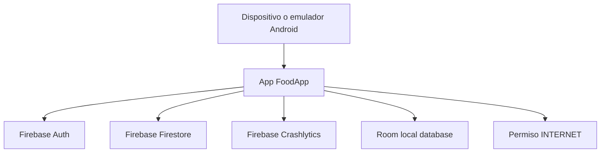

# D08 - Despliegue y servicios

```mermaid
flowchart TD
A[Dispositivo o emulador Android] --> B[App FoodApp]
B --> C[Firebase Auth]
B --> D[Firebase Firestore]
B --> E[Firebase Crashlytics]
B --> F[Room local database]
B --> G[Permiso INTERNET]
```
